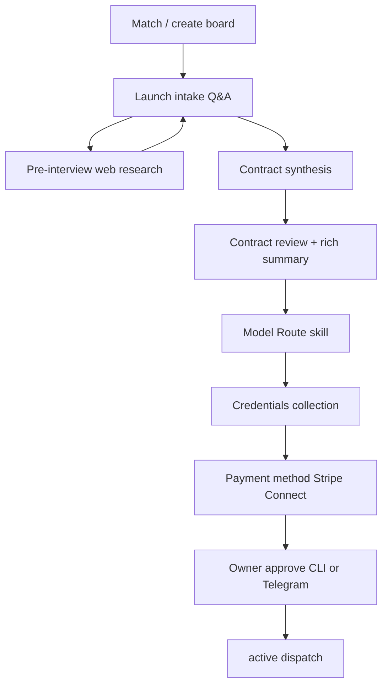

# Kanban launch contract vision

Target architecture for enforced launch flow, portable contracts, and owner-readable approval on CLI and Telegram.

## Target flow



Hard gates (no shortcuts):

- Direct hand-authored contracts without saved intake are rejected when `require_launch_intake` is enabled (CLI profile + tools).
- Synthesis before Q&A completion is blocked by intake state and `launch_intake.answer_quality`.
- Approval token mint and `/approve <board>` fail closed on credentials, payment, and intake blockers.

## Contract lifecycle states

| contract_status | launch_phase | Meaning |
| --- | --- | --- |
| draft | draft / draft_intake | Intake incomplete or contract invalid |
| pending_credentials | pending_credentials | Contract ready; API keys missing |
| pending_payment | pending_payment | Credentials ok; board-scoped payment missing |
| pending_approval | pending_approval / contract_review | All inputs satisfied; awaiting owner approve |
| active | active | Dispatch enabled |

`contract_status` is persisted on the operating contract (`contract_status` and `runtime.contract_status`) for portable querying.

## Schema extensions (P0 scaffold)

### runtime.budget

```json
{
  "preference": "quality | balanced | budget",
  "weekly_usd_cap": null,
  "monthly_usd_cap": null,
  "token_budget_weekly": null,
  "weekly_task_estimate": 40,
  "tokens_per_task_estimate": 25000,
  "accuracy": "estimate"
}
```

### runtime.cost_projection

Generated by `hermes_cli.kanban_launch_cost.project_contract_costs()` — always includes `accuracy: estimate` and a disclaimer until metered usage (P1).

### runtime.payment (Stripe Connect scaffold)

```json
{
  "provider": "stripe_connect",
  "scope": "board",
  "required": true,
  "status": "pending",
  "stripe_connect_account_id": null
}
```

Board-local stub state: `boards/<slug>/payment.connect.json` (P0). Full Connect onboarding in P1.

### launch_required_inputs

Existing schema plus:

```json
{"key": "payment_method", "label": "Board payment method", "type": "payment_method", "required": true}
```

Secrets remain in `credentials.vault`; payment is assessed separately.

### Quality / HITL (portable)

- **Quality metrics**: `objective.success` entries (scoreable targets).
- **HITL policy** (optional): `hitl_policy.mode` or `runtime.hitl_policy.balance` — `light | balanced | strict`.
- P1: feedback loop from owner quality signals into domain prompts.

## Representation formats

| Surface | Module | Notes |
| --- | --- | --- |
| Telegram owner message | `kanban_launch_summary.render_owner_contract_summary` | Markdown, sections table embedded in CLI review |
| CLI review | `hermes kanban boards contract review` | Sections table + owner summary |
| Export | `hermes kanban boards contract export --format markdown\|asciidoc\|json` | Portable artifact |
| Agents | `export_contract_document(format=json)` | Structured facts + contract |

## Model Route skill

Path: `skills/autonomous-ai-agents/model-route/SKILL.md`

Guides quality vs budget conversation, writes `runtime.models` and `runtime.budget`, surfaces projected costs before approval.

## Stripe Connect integration points (P1)

1. `kanban_stripe_connect.assess_board_payment` — gate (P0 stub).
2. `hermes kanban boards payment connect` — OAuth / account link (P1).
3. Webhook handler — set `payment.connect.json` status to `connected`.
4. Scoped billing — charge only models + integrations declared on the board contract.

## Cost projection engine (P0 estimate / P1 accurate)

P0: heuristic token rates + capability_catalog `cost.model` notes.

P1: join dispatcher metrics, provider invoices, and SMS/ad spend sensors for weekly actuals vs projection.

## HITL balance framework

| Mode | Behavior |
| --- | --- |
| light | Approve only irreversible/financial external actions |
| balanced | Default — gated external writes; autonomous internal tuning |
| strict | Additional sampling on subjective deliverables (creative, outbound copy) |

Portable via contract fields; enforcement expands in P1 with quality feedback loop.

## Phased roadmap

### P0 (shipped in this pass)

- Lifecycle phases and `contract_status`
- Rich summary + export
- Model Route skill
- CLI/Telegram approval gate blockers
- Domain-aware intake prompts
- Budget/cost projection scaffold
- Stripe Connect assessment stub

### P1

- Full Stripe Connect onboarding and scoped billing
- Metered cost accuracy (weekly reconciliation)
- HITL quality feedback loop (owner thumbs-down -> prompt/workflow adjustment)
- AsciiDoc UML funnel export for workflow stages

### P2

- Contract query API across clients
- Contract authoring skill with invariant-aware templates
- Cross-board cost analytics dashboard

## Audit summary (Phase A)

| Requirement | Existed | Gap closed in P0 |
| --- | --- | --- |
| Enforced launch flow | Partial (intake, tokens, `/approve` rail) | Explicit lifecycle gates + blockers on token mint |
| Contract presentation | `kanban_launch_summary` prose | Sections table, export, budget/quality sections |
| Model routing in contract | `runtime.models`, `kanban_model_routing` | Model Route skill + budget tie-in |
| Domain intake | Pre-interview research, aux prompts | Stronger domain-aware question prompt |
| Budget transparency | capability_catalog cost notes | `runtime.budget` + `cost_projection` estimates |
| Lifecycle states | `launch_phase` coarse | `draft`..`pending_*`..`active` + `contract_status` |
| Credentials | `kanban_credentials` vault | Gates unchanged; payment separated |
| Stripe | stripe_secret_key in vault only | board-scoped payment scaffold |
| HITL / quality | objective.success, approval_gates | Quality metrics in summary; HITL policy field documented |
| Portable contracts | board.json business_contract | export + contract_status on contract |
